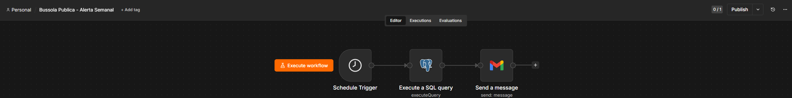

# 🧭 Bússola Pública

> Pipeline ETL de inteligência legislativa com IA — API da Câmara dos Deputados


---

## 🌐 Links do Projeto

🔗 **Frontend interativo:** https://compass-legislative.lovable.app  
🔗 **Repositório:** https://github.com/Cecilia-Nascimento/bussola-publica  
🔗 **Banco de dados:** https://supabase.com/dashboard/project/cbaakbwnwqnelqtdwley

---

## 📋 Sobre o Projeto

A **Bússola Pública** é um pipeline automatizado de inteligência legislativa desenvolvido como projeto integrador da pós-graduação em Engenharia de Dados.

O problema: consultorias de relações governamentais gastam horas lendo o site da Câmara dos Deputados manualmente para montar relatórios semanais. Esse projeto automatiza esse processo do início ao fim.

**O pipeline:**
1. Extrai dados da API pública da Câmara dos Deputados
2. Transforma e valida os dados com Pandas
3. Carrega em um banco PostgreSQL na nuvem (Supabase)
4. Classifica proposições por tema usando embeddings da OpenAI
5. Gera resumos executivos via GPT-4o-mini
6. Entrega relatório semanal automatizado via n8n

---

## 🏗️ Arquitetura do Pipeline

API Câmara dos Deputados
↓
Extração Python (requests + paginação)
↓
JSONs brutos (data/raw/)
↓
Transformação Pandas (normalização + validação)
↓
PostgreSQL Supabase (deputados, partidos, proposicoes, votacoes)
↓
Camada de IA (embeddings + resumos OpenAI)
↓
n8n (relatório semanal por email)

---

## 🗄️ Modelo de Dados

### Tabelas dimensão
| Tabela | Descrição | Registros |
|--------|-----------|-----------|
| `deputados` | 512 deputados federais ativos | 512 |
| `partidos` | Partidos com representação | 21 |

### Tabelas fato
| Tabela | Descrição | Registros |
|--------|-----------|-----------|
| `proposicoes` | Projetos de lei e proposições | 15.562 |
| `votacoes` | Votações em plenário e comissões | 1.532 |
| `despesas` | Despesas da cota parlamentar | 7.430 |

**Total:** 25.117 registros — período maio/2026

### Colunas geradas por IA
- `tema` — classificação temática via embeddings
- `resumo_ia` — resumo executivo gerado pelo GPT-4o-mini

## 🤖 Camada de IA

### Caminho A — Classificação temática por embeddings
- Modelo: `text-embedding-3-small` (OpenAI)
- Temas: Saúde, Tributário, Tecnologia, Trabalho, Meio Ambiente, Educação, Segurança Pública, Economia, Infraestrutura, Outros
- Método: similaridade de cosseno entre embedding da ementa e embedding de cada tema
- Resultado: coluna `tema` na tabela `proposicoes`

### Caminho B — Resumo executivo
- Modelo: `gpt-4o-mini`
- Prompt: resumo em 2 linhas em linguagem clara para executivos
- Resultado: coluna `resumo_ia` na tabela `proposicoes`

> **Nota técnica:** O script de IA é idempotente — processa apenas proposições com `tema IS NULL`. Isso permite escala gradual conforme budget disponível, sem reprocessar registros já classificados.

---

### 🤖 Chatbot IA

O chatbot usa a API da OpenAI (GPT-4o-mini). Para usar:
1. Acesse https://platform.openai.com/api-keys
2. Crie uma chave gratuita
3. Cole no campo "Chave OpenAI" no site
4. A chave fica salva no navegador automaticamente

> A chave não é armazenada em servidores — fica apenas no localStorage do seu navegador.

---

## ⚙️ Automação n8n

Workflow: **Bússola Pública — Alerta Semanal**



- **Gatilho:** toda segunda-feira às 6h
- **Passo 1:** query SQL no Supabase buscando 5 proposições com tema e resumo
- **Passo 2:** envio de email HTML formatado via Gmail

---

## 🖥️ Frontend

Interface web completa construída com React 19, TanStack Router e Shadcn UI.
Conectada ao Supabase em tempo real — dados ao vivo do banco PostgreSQL.

🔗 **Demo online:** https://compass-legislative.lovable.app

**Páginas disponíveis:**
- Home — visão geral do projeto e métricas
- Dashboard — KPIs, gráficos de temas e partidos ao vivo
- Proposições — tabela filtrável com tema e resumo IA
- Deputados — 513 deputados com fotos e perfis reais
- Chatbot IA — perguntas em linguagem natural sobre legislação
- Pipeline — arquitetura técnica detalhada
- Modelo de Dados — estrutura das tabelas
- Camada de IA — embeddings e resumos
- Automação n8n — workflow semanal
- Apresentação — pitch completo do projeto

### Rodar o frontend localmente

```bash
cd frontend
npm install
npm run dev
# Acesse: http://localhost:8080
```

**Stack do frontend:**
- React 19 + TanStack Router
- Shadcn UI + Tailwind CSS
- Recharts para gráficos
- Supabase JS para dados em tempo real
- OpenAI para chatbot legislativo

---

## 🚀 Como Rodar o Pipeline

### Pré-requisitos
- Python 3.11+
- Conta no Supabase (gratuita)
- Chave de API da OpenAI

### Instalação

```bash
# Clonar o repositório
git clone https://github.com/Cecilia-Nascimento/bussola-publica.git
cd bussola-publica

# Criar e ativar ambiente virtual
python -m venv .venv
.venv\Scripts\activate       # Windows
source .venv/bin/activate    # Mac/Linux

# Instalar dependências
pip install -r requirements.txt

# Configurar variáveis de ambiente
copy .env.example .env
# Editar .env com suas credenciais
```

### Executar

```bash
# Etapa 2 — Extração
python src/extractor.py

# Etapa 3 — Transformação e carga
python src/loader.py

# Etapa 4 — Camada de IA
python src/ai_layer.py
```

---

## 📁 Estrutura do Projeto

```
bussola-publica/
│
├── data/
│   ├── raw/              # JSONs brutos da API
│   └── processed/        # Dados processados
│
├── frontend/             # Interface React
│   ├── src/
│   │   ├── routes/       # Páginas do app
│   │   ├── components/   # Componentes UI
│   │   └── lib/          # Supabase e utilitários
│   └── package.json
│
├── notebooks/
│   └── 01_exploracao_api.ipynb
│
├── src/
│   ├── extractor.py      # Extração da API
│   ├── transformer.py    # Transformação Pandas
│   ├── loader.py         # Carga no PostgreSQL
│   └── ai_layer.py       # Embeddings e resumos
│
├── n8n/
│   └── workflow.json     # Workflow exportado
│
├── .env.example
├── requirements.txt
└── README.md
```

## 🔧 Decisões Técnicas

**Por que Supabase?**
PostgreSQL gerenciado na nuvem com plano gratuito generoso, painel visual e fácil integração com n8n.

**Por que salvar JSON bruto antes de transformar?**
Separar extração de transformação garante que, se o código de transformar quebrar, não é necessário refazer a chamada à API.

**Por que embeddings para classificação de tema?**
Classificação semântica é mais robusta que keywords — captura contexto mesmo quando as palavras exatas do tema não aparecem na ementa.

**Por que gpt-4o-mini para resumos?**
Melhor custo-benefício para geração de texto — qualidade próxima ao GPT-4 a uma fração do custo.

**Por que React com TanStack Router no frontend?**
Stack moderna usada no mercado, com roteamento tipado, Shadcn UI e integração nativa com Supabase em tempo real.

---

## 👩‍💻 Autora

**Cecilia Nascimento**  
Pós-graduação em Engenharia de Dados

[](https://github.com/Cecilia-Nascimento)